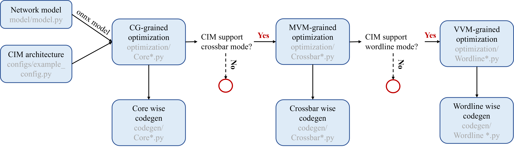

# CIM-MLC:  Multi-level Compilation Stack for Computing-In-Memory Accelerators
CIM-MLC is a general compiler that features the unified abstraction from diverse CIM hardware and multi-level scheduling with abundant meta-operators. 

The following diagram shows the workflow of MLC-CIM.
 

Specifically, we use hardware abstraction to provide the same description format of architecture parameters and computing mode for the various CIM designs. To decouple the data mapping and computing scheduling with one architectural design, we propose multi-level scheduling technology to handle the computing mode for different architectural tiers in the CIMs. The multi-level scheduler tailors the optimization method for each computing mode, applies the optimization method independently or jointly according to the abstraction of the CIM accelerator, and finally generates the meta-operator flow for the CIM accelerator.

## Getting Started
### Requirements
```
torch
onnx==1.13.0
onnxruntime==1.14.0
numpy
einops
```

👉 Users can install those packages using the `pip install -r requirement.txt` command under this folder. 
### Folder structure
```bash
CIM-MLC
├── codegen
│    ├── Addr.py
│    ├── CoreWise.py
│    ├── CrossbarWise.py
│    ├── WordlineWise.py
│    ├── CoreWiseCodeTem.py
│    ├── CrossbarCodeTem.py
│    └─ WordlineCodeTem.py
├── configs
│    ├── __init__.py
│    ├── architecture.py
│    ├── example_config.py
│    ├── ISSCC21_15_1.py
│    ├── Jain21.py
│    ├── PUMA.py
│    └── README.md
├── onnx_model
│    └── conv.onnx
├── optimization
│    ├── __init__.py
│    ├── CoreDup.py
│    ├── CoreMapping.py
│    ├── CorePipe.py
│    ├── CrossbarDup.py
│    ├── CrossbarPipe.py
│    └── WordlineRemap.py
├── utils
│    └── util.py
├── README.md
├── requirement.txt
└── main.py
```

### Usage
#### Hardware Description
The hardware architecture is defined in `configs/architecture.py`. Users can build their own architecture by changing the corresponding parameters in `configs/example_config.py`. 

```bash
cd configs
vim example_config.py
```

For more details about the hardware architecture description (i.e. meaning of parameters), please refer to the `README.md` file in the `config` folder.

#### Network Definition
Our compilation tool uses [ONNX](https://github.com/onnx/onnx)-formatted neural networks as input. To facilitate user convenience, we provide a tool for converting neural networks defined in popular deep learning platforms like PyTorch into ONNX format. Users simply need to define their network model under the `model` directory.

For example:
```bash
cd model
vim YOUR_MODEL_NAME.py
```

#### Compilation
Open the terminal in this folder, and use the following comment. (using the pre-defined architecture and model as an example). The following comment will save the generated meta-operator flow in `INSTRUCTION_SAVE_PATH`. We give some meta-operator examples in the `output` folder
```bash
python main.py  -onnx_model_path ./onnx_model/conv.onnx --ifmsize 1 3 32 32 --arch_config_module configs.example_config
```

```bash
Usage: python main.py [options]

Parameters definition:

Required arguments:
  -onnx_model_path ONNX_MODEL_PATH
                                specify the path to the ONNX model file
  --ifmsize IFMSIZE 
                                specify the size of the input feature map (default: 1 3 32 32)
  --arch_config_module ARCH_CONFIG_MODULE
                                specify the Python module containing the CIM architecture configuration (default: configs.example_config)

Optional arguments:
  -h, --help                    show this help message and exit
  --output_dir OUTPUT_DIR       specify the directory to save the output files 

```

**Kindly reminder, this repository is just a beta version. The complete compilation tools and model testing results will be released subsequently.**

## Acknowledgements
* [ONNX](https://github.com/onnx/onnx)
* [PUMA](https://github.com/Aayush-Ankit/puma-simulator)
* [NeuroSim](https://github.com/neurosim)
