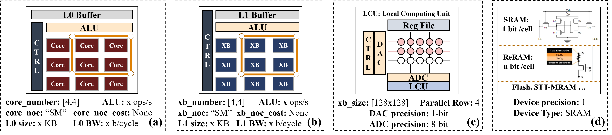

# CIM architecture abstrction
___
## illustration
___
The hardware architecture abstrction example is shown in the figure. We model the CIM-based DNN accelerator as a hierarchical architecture, which contains four tiers from top to bottom: (a) chip, (b) core, (c) crossbar and (d) device.

## configuration
___
| Parameters      | Description |format |
| :---        |    :----:   | :----: |
| API       | computation mode the architecture can support  | 'Core', 'Crossbar' or 'Crossbar'|
|||  |
| CoreNum   | core number of one chip   | [core num in row, core num in column] |
| CoreNoc   | noc betweent cores        | 'Mesh', 'H-tree', etc|
| CoreNocCost   | noc cost matrix        | matrix record the data transmission cost between each core|
| GBBuf   | Global buffer size        | X kb|
| CoreALU   | core ALU         | X operation/s|
| CoreBus   | Global buffer bandwidth        | X bit/s|
||| |
| XBNum   |   crossbar number of one core     |[crossbar num in row, crossbar num in column] |
| XBNoc   | noc betweent crossbars        | 'Mesh', 'H-tree', etc|
| XBNocCost   | noc cost matrix        |matrix record the data transmission cost between each crossbar |
| LCBuf   | Local buffer size         | X kb|
| XBALU   | crossbar ALU        | X operation/s|
| XBbus   | Local buffer bandwidth        |X bit/s |
| XBSize   | crossbar size        | [cell num in row, cell num in column] |
| MaxRC   | Maximum number of rows that can be activated simultaneously        ||
||| |
| Type   | device type        |'ReRAM', 'SRAM', etc |
| Precision   | precision of crossbar cell       |X bit |

